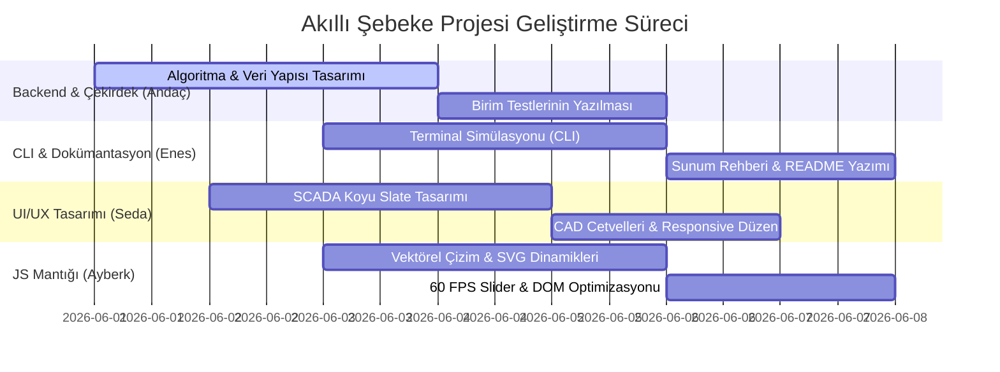

# 👥 Proje Görev Dağılımı (Task Distribution)

Bu dosya, **SmartGrid-Core: Öncelik Tabanlı Dinamik Enerji Dağıtım Algoritması** projesinde yer alan ekip üyelerinin üstlendiği sorumlulukları, geliştirilen modülleri ve görev dağılımını belgelemek amacıyla oluşturulmuştur.

---

## 🚀 Ekip Üyeleri ve Rol Özetleri

| Üye | Rol | Ana Sorumluluk Alanı | Geliştirilen Dosyalar |
| :--- | :--- | :--- | :--- |
| **Andaç** | Proje Koordinatörü & Algoritma Tasarımcısı | Algoritmik mimari, dağıtım matematiği ve test doğrulama | `smart_grid.py`, `test_smart_grid.py` |
| **Seda** | Arayüz Geliştirici & UI/UX Tasarımcısı | SCADA arayüz tasarımı, CAD cetvelleri, responsive yapılar | `dashboard.html` (CSS & HTML) |
| **Ayberk** | Frontend Mantığı & Optimizasyon | JavaScript akış kontrolü, 60 FPS slider performansı, vektörel çizim matematiği | `dashboard.html` (JS & SVG Mantığı) |
| **Enes** | CLI Uygulaması & Teknik Yazar | Terminal simülasyonu, ASCII grafikleri, jüri sunum dokümanları | `main.py`, `README.md`, `presentation_guide.md` |

---

## 🛠️ Detaylı Görev Dağılımı ve Sorumluluklar

### 1. Andaç (Proje Koordinatörü & Algoritma Tasarımcısı)
* **Algoritma Tasarımı ve Çekirdek Kodlama:** 
  - `smart_grid.py` modülünde yer alan **Greedy (Açgözlü)** dağıtım mekanizmasının tasarlanması.
  - Abonelerin öncelik seviyelerine (1: Kritik, 2: Normal, 3: Düşük) göre işlenmesini sağlayan **Öncelik Kuyruğu (Priority Queue / Min-Heap)** yapısının `heapq` ile kodlanması.
* **Fiziksel Modelleme:**
  - Dağıtım hatlarındaki iletim kayıplarının mesafe bazlı hesaplanması için Euclidean (Öklid) mesafesine dayalı %1/km kayıp formülünün tasarlanması.
* **Kalite ve Test:**
  - `test_smart_grid.py` dosyasındaki birim testlerin (Unit Tests) yazılması; $O(1)$ Hash Map aramalarının ve $O(N \log N)$ sıralama algoritmalarının doğruluğunun test edilmesi.

> [!NOTE]
> Andaç, projenin backend/matematiksel çekirdeğinin kurulmasını ve frontend modüllerinin bu çekirdeğe doğru parametrelerle entegre edilmesini koordine etmiştir.

---

### 2. Seda (Arayüz Geliştirici & UI/UX Tasarımcısı)
* **SCADA Panel Görsel Tasarımı:**
  - Siemens ve Tesla kontrol merkezlerinden esinlenen, göz yormayan, profesyonel endüstriyel **Koyu Slate** temasının (`dashboard.html` CSS) geliştirilmesi.
  - Bileşen sınırlarının, renk paletlerinin (nominal yeşil, kriz kırmızı, uyarı sarı) seçilmesi ve uygulanması.
* **Mühendislik Cetvelleri (CAD Rulers):**
  - Grid arka planı üzerine yerleştirilen üst (X-ekseni) ve sağ (Y-ekseni) ince CAD cetvellerinin tasarlanması.
  - Cetvellerin şebeke alanını kısıtlamaması için Y=3 ve X=797 koordinat sınırlarına (tam kenarlara) çekilerek yazılarının hizalanması.
* **Kullanıcı Deneyimi:**
  - Abone ekleme formundaki emoji ikon seçici arayüzünün tasarlanması ve responsive yerleşim şemalarının kurulması.

---

### 3. Ayberk (Frontend Mantığı & Dinamik Entegrasyon)
* **SVG Vektörel Çizim Matematiği:**
  - İletim hattı oklarının ve çizgilerinin, düğüm çemberlerinin yarıçaplarına göre tam sınırda son bulmasını sağlayan birim vektör matematiğinin JavaScript tarafında kodlanması.
  - Toplam eleman sayısı arttıkça düğüm ve font boyutlarını otomatik küçülten dinamik ölçeklendirme algoritmasının geliştirilmesi.
* **Performans Optimizasyonu:**
  - Jeneratörlerin güç ve konum sürgüleri (sliders) oynatılırken yaşanan kasılmaları önlemek adına, DOM elemanlarının yeniden üretilmesi yerine anlık olarak yerinde (in-place) güncellenmesini sağlayan 60 FPS performans mimarisinin kodlanması.
* **Etkileşim Kontrolleri:**
  - Sürgüler ile doğrudan sayısal veri giriş alanlarının (Numeric Input) anlık olarak çift yönlü senkronize çalışmasının sağlanması.

---

### 4. Enes (CLI Uygulaması & Teknik Yazar)
* **CLI Terminal Simülasyonu:**
  - `main.py` içerisindeki renkli, animasyonlu terminal kullanıcı arayüzünün kodlanması.
  - Senaryo geçişleri sırasında çalışan spinner (yükleme ikonu) ve pulse (nabız animasyonu) efektlerinin geliştirilmesi.
* **ASCII Şebeke Grafik Tasarımı:**
  - Terminal ekranında şebeke topolojisini görselleştiren dinamik ASCII grafik motorunun kodlanması.
* **Teknik Dokümantasyon:**
  - Proje savunma jürisi öncesinde çalışılacak olası soruları içeren `presentation_guide.md` rehberinin hazırlanması.
  - Proje reposunun kapak belgesi olan `README.md` dosyasının algoritmik karmaşıklık analizleri ve görsellerle zenginleştirilerek yazılması.

---

## 📊 İş Paketleri Gelişim Şeması

